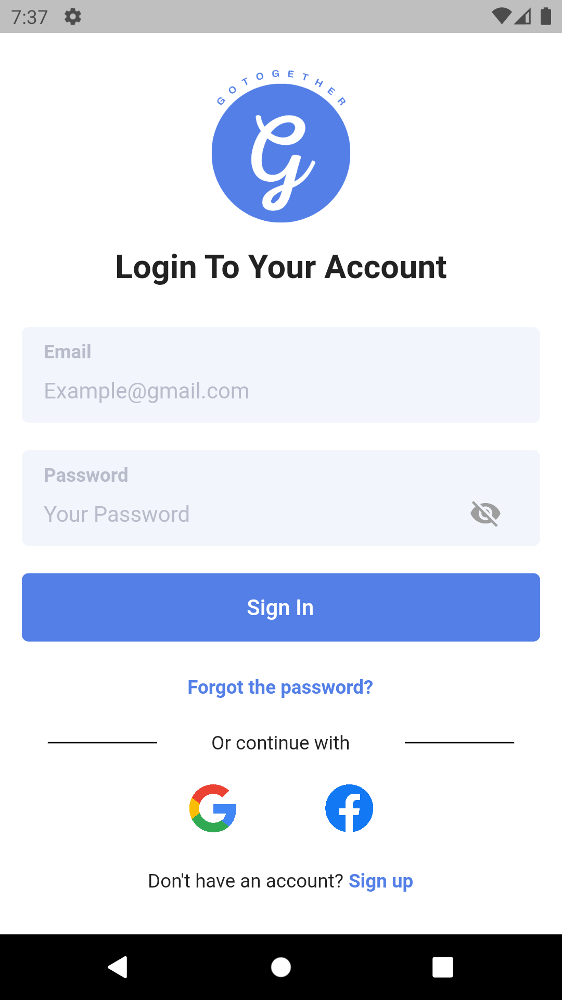
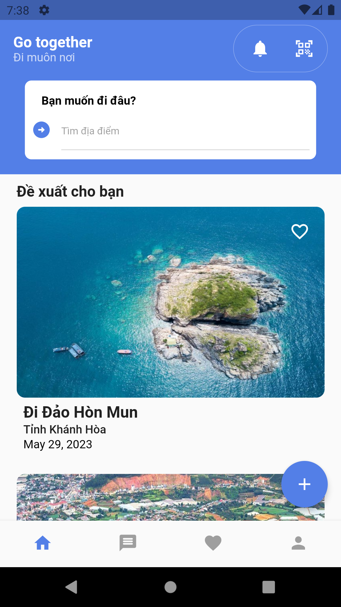
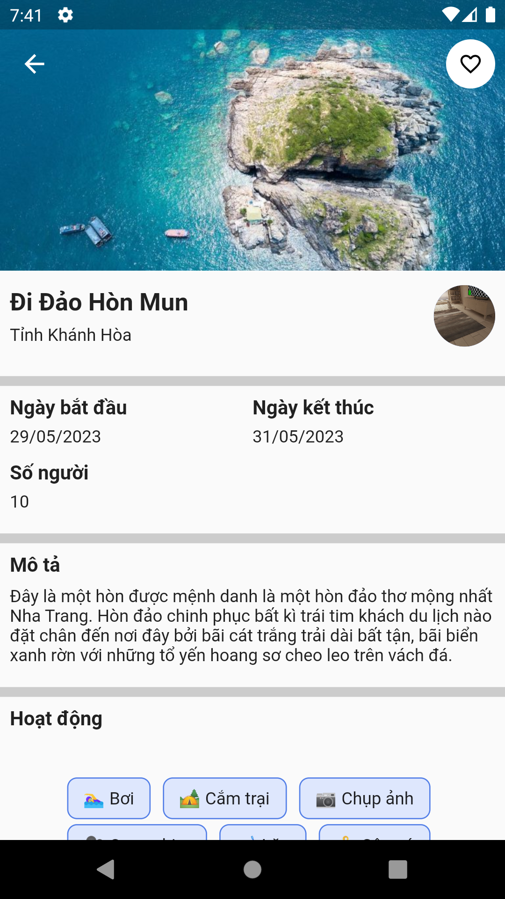
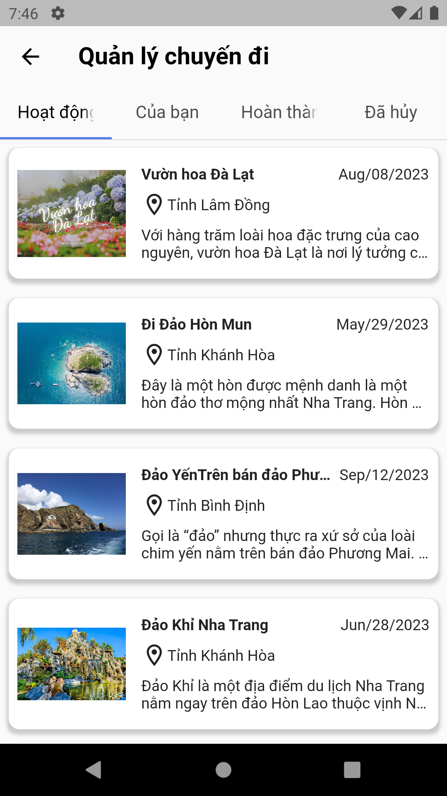

# Go Together App

## Description
A social media application allows travelers to connect and socialize, creating memorable experiences during their journeys. Additionally, the process of planning, exploring, and managing trips becomes more intuitive, user-friendly, and convenient.

<div style="display: flex; justify-content: space-around;">
  
  
  
  
</div>

## Installation
1. Clone the repo
   ```sh
   git clone https://github.com/iawtk2302/GoTogether.git
   ```
2. Get packages
   ```sh
   flutter pub get
   ```
4. Run the project
   ```sh
   flutter run
   ```

## Contributors
* [Nguyễn Tuấn Khôi](https://github.com/iawtk2302)
* [Nguyễn Bá Khanh](https://github.com/bakhanh113ct)

## Others
Recommendation system: https://github.com/iawtk2302/gotogether_recommendation_api.git
